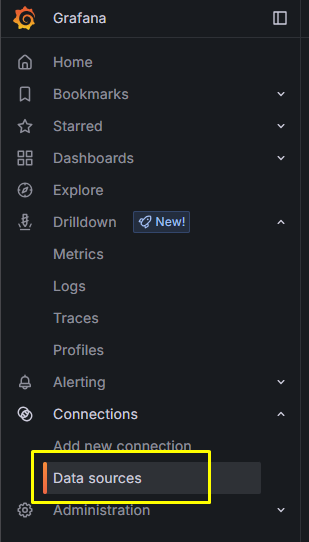

## Loki

```bash
helm show values grafana/loki > loki.yaml
```
Edit `loki.yaml` and add the following
```yaml
  clusterDomain: "<cluster-name>"
  # -- configures DNS service name
  dnsService: "coredns"
  # -- configures DNS service namespace
  # dnsNamespace: "dns"
# If you are using and external dns for your cluster DON'T use it, just use the internal dns in kube-system 
  dnsNamespace: "kube-system"

loki:
   auth_enabled: false

  server:
    http_listen_port: 3100
    grpc_listen_port: 9095
    http_server_read_timeout: 600s
    http_server_write_timeout: 600s

  limits_config:
    retention_period: 744h  # 31 days; match legacy for now
    max_query_lookback: 744h  # Blocks old queries
    allow_structured_metadata: false 

   storage:
    filesystem:
      data_directory: /var/loki/data
  schemaConfig:
    configs:
      - from: "2025-11-11"  # ~1 month ago (Dec 11 - 30 days)
        store: boltdb-shipper  # Or tsdb/v13 if upgraded
        object_store: filesystem
        schema: v12
        index:
          prefix: index_
          period: 24h  # Enables granular deletions
  # -- a real Loki install requires a proper schemaConfig defined above this, however for testing or playing around
  # you can enable useTestSchema
  # useTestSchema: true
  useTestSchema: false

  compactor:
    # enabled: true
    retention_enabled: true  # Flips to true
    apply_retention_interval: 24h  # Schedules runs every 24h (was 0s)
    retention_delete_delay: 2h
    retention_delete_worker_count: 150
    working_directory: /var/loki/data  # Or /data/loki
    # working_directory: /loki/compaction  # Or /data/loki
    # expand_env: true
    # shared_store: filesystem
    delete_request_store: filesystem
```
Apply Loki

We are applying the promethues, loki , promtail , and grafan all in one namespace to ease connectivity.

```bash
helm upgrade --install loki grafana/loki -f infrastructure/prometheus/loki/loki.yaml -n prometheus
```

Wait for pods to be ready, then go next.

## Promtail

It collect logs and push them to loki


```bash
helm show values grafana/promtail > promtail.yaml
```
Edit promtail.yaml
And if there is any taints set to nodes just remeber to add to collect all log from your workloads.
```yaml
config:
  clients:
    - url: http://loki-gateway/loki/api/v1/push


tolerations:
  - key: <key>
    operator: Equal
    value: "true"
    effect: NoSchedule
```

```bash
helm upgrade --install promtail grafana/promtail -f infrastructure/prometheus/loki/promtail.yaml -n prometheus
```

In Grafana:
Go to Datasource as follows:




Then explore and make sure you have logs are coming out.

Create your dashboard


Edit settings as shown in yellow boxes.


Create a variable as shown.


